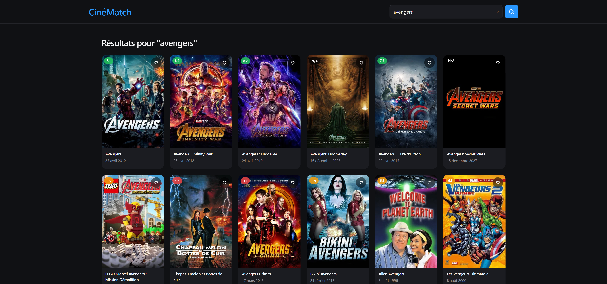
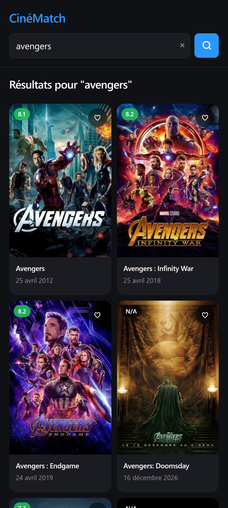

# CinéMatch

CinéMatch est une application web de découverte et de catalogue cinématographique de type Single Page Application (SPA) réalisée en HTML, CSS et JavaScript. Elle permet de parcourir les films tendances du jour, de rechercher dans la base TMDB, de consulter les détails complets d'un film et de gérer une liste de favoris persistante.



<p align="center">
  
</p>

## Démo

- GitHub Pages : https://flammeduciel.github.io/CineMatch/
- Repository : https://github.com/Flammeduciel/CineMatch

## Fonctionnalités

- Afficher les films tendances du jour récupérés depuis l'API TMDB via `fetch()` et `async/await`
- Afficher dynamiquement les cartes films (poster, titre, date de sortie, note) générées en JavaScript
- Gérer les états de chargement avec un spinner animé et les erreurs réseau avec bouton de réessai
- Rechercher des films en temps réel par titre via la barre de recherche
- Consulter les détails complets d'un film dans un modal natif (`<dialog>`) avec poster, synopsis, genres et note
- Ajouter ou retirer des films de la liste de favoris depuis les cartes ou le modal
- Synchroniser l'état favori entre toutes les instances visibles d'un même film
- Persister les favoris dans le `localStorage` pour conserver la liste après rafraîchissement
- Afficher une section « Mes Favoris » qui apparaît et disparaît dynamiquement
- Afficher un état « Aucun film trouvé » lorsqu'aucun résultat ne correspond à la recherche
- Basculer automatiquement entre les thèmes clair et sombre selon les préférences système
- Utiliser l'interface au clavier (Entrée pour rechercher, Échap pour fermer le modal) et avec une préférence de réduction des mouvements

## Expérience responsive

Sur ordinateur, les films s'affichent dans une grille responsive utilisant CSS Grid, avec des cartes contenant le poster, la note colorée, le titre et la date de sortie. Un en-tête sticky contient la barre de recherche et le titre de l'application. Le modal de détail affiche le poster et les informations côte à côte.

Sur mobile, la grille s'adapte avec des colonnes plus compactes. L'en-tête se repositionne verticalement, et le modal passe en mise en page empilée pour optimiser l'espace. Les animations de survol et les transitions restent fluides tout en respectant la préférence de réduction des mouvements.

## Lancer le projet

Ouvrir `index.html` dans un navigateur moderne ou démarrer un serveur local :

```bash
python -m http.server 8000
```

Puis visiter `http://localhost:8000`.

## Organisation du code

```text
CinéMatch/
├── images/
│   └── preview/
│       ├── cinematch-desktop.png   # Aperçu ordinateur
│       └── cinematch-mobile.png    # Aperçu mobile
├── index.html                      # Structure HTML sémantique
├── css/
│   └── styles.css                  # Variables CSS, composants et responsive design
├── js/
│   ├── api.js                      # Couche d'appel à l'API TMDB
│   ├── favorites.js                # Gestion des favoris avec localStorage
│   └── app.js                      # Logique JavaScript principale
└── README.md                       # Documentation
```

Les scripts sont chargés comme scripts classiques afin de conserver l'ouverture locale directe. `api.js` encapsule les appels à l'API TMDB (films tendants, recherche, détails). `favorites.js` gère la persistance des favoris. `app.js` rassemble le rendu des films, la recherche, la gestion du modal et toutes les interactions. Les variables CSS, composants et la mise en page responsive sont regroupés dans `styles.css`.

## Déploiement GitHub Pages

Le site peut être publié depuis la branche `main` et le dossier racine. Pour activer GitHub Pages :

1. Créer un dépôt GitHub
2. Pousser le code dans la branche `main`
3. Aller dans Settings > Pages
4. Sélectionner la branche `main` et le dossier `/` (root)
5. Sauvegarder

Le site sera accessible à l'URL `https://flammeduciel.github.io/CineMatch/`

## Technologies

- HTML5 sémantique (éléments `<header>`, `<main>`, `<section>`, `<article>`, `<dialog>`)
- CSS avec Grid, Flexbox, propriétés personnalisées (variables CSS), `clamp()`, `aspect-ratio`, `backdrop-filter`
- JavaScript natif (ES6+) avec async/await et IIFE
- API TMDB (The Movie Database) pour la récupération des films
- localStorage pour la persistance des favoris
- Support du thème sombre automatique via `prefers-color-scheme`
- Accessibilité : navigation clavier, attributs ARIA, `prefers-reduced-motion`

## Git Workflow

- Branche `main` : code stable
- Branche `develop` : intégration
- Branches `feature/*` : nouvelles fonctionnalités

### Commits

Format : `type: description courte`

Types : feat, fix, docs, style, refactor, test, chore

## Cadre de réalisation

Projet réalisé dans le cadre de l'apprentissage à Akieni Academy.
